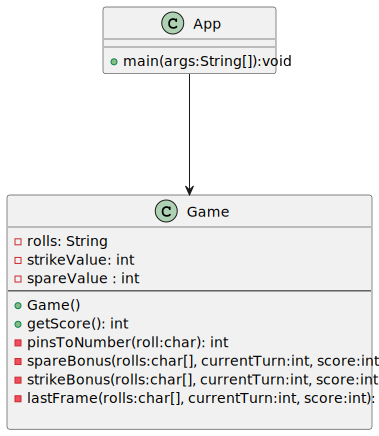

# Kata Bowling resuelto utilizando TDD.

## I. Lógica del juego


La lógica de la aplicación es la siguiente.

Dada una secuencia válida de tiradas para una partida de bolos, la aplicación devuelve la puntuación total del juego. 

Este es un resumen de las reglas del juego:

- Cada partida de bolos incluye diez turnos, o _frames_, para la persona lanzadora.
- En cada _frame_ el jugador realiza hasta dos intentos para derribar todos los bolos o _pins_.
- Si en dos intentos no logra derribar todos los bolos, su puntuación para ese _frame_ es el número total de bolos derribados en sus dos intentos.
- Si en dos intentos los derriba todos, consigue un _spare_ y su puntuación en el _frame_ es `10` más el número de bolos derribados en su siguiente intento. Consulta [cómo se calcula la puntuación obtenida en un _spare_](https://es.wikipedia.org/wiki/Spare).
- Si en su primer intento en el _frame_ derriba todos los bolos, consigue un _strike_. Su turno termina con ese primer lanzamiento (no lanza una segunda bola) y su puntuación en ese _frame_ es `10` más el total de los bolos derribados en sus dos siguientes lanzamientos. Consulta [cómo se computa la puntuación obtenida en un _strike_](https://es.wikipedia.org/wiki/Strike_(bowling)).
- Si obtiene un _spare_ o un _strike_ en el último (décimo) _frame_, el jugador puede lanzar una o dos bolas extra, respectivamente. Estas bolas extra forman parte del mismo turno. Si los tiros extra derriban todos los bolos, no se obtienen más tiradas extra. Los tiros extra sólo se utilizan para calcular la puntuación del último _frame_.
- La puntuación de la partida es la suma de las puntuaciones de todos los _frames_.

## II. Test sugeridos para desarrollar la lógica.

  **testNormalScore:**
  `12345123451234512345`

  Partida normal donde unicamente hay que sumar los bolos derribados en cada tirada. `Puntuación: 60`.

  **testHeartBreakGame:**
  `9-9-9-9-9-9-9-9-9-9-`
  
  Partida donde se ha fallado una de cada 2 tiradas. El guión representa que se han tirado 0 bolos en esa tirada (turn). `Puntuación: 90`.

  **testSpareEveryFrameGame:**
  `5/5/5/5/5/5/5/5/5/5/5`

  Partida donde se ha hecho un semipleno (Spare) en cada turno (frame). `Puntuación: 150`.
  
  **testWithStrikeGame:**
  `5-5-5-5-5-X5-5-5-5-`
  
  Partida donde se ha hecho un pleno (Strike) y se han fallado multiples tiradas(turns). `Puntuación: 60`.

  **testTwoStrikesInARowGame:**
  `5-5-5-5-5-XX5-5-5-`

  Partida donde se han hecho dos plenos (Strike) y se han fallado multiples tiradas(turns). `Puntuación: 80`.

  **testTwoStrikesThenSpareGame:**
  `5-5-5-5-5-XX5/5-5-`

  Partida donde se han hecho dos plenos (Strike) seguidos de un semipleno (Spare) y se han fallado multiples tiradas(turns). 
  `Puntuación: 95`.

  **testTwoStrikesOneSpareGame:**
  `5-5-5-5-5-XX5-5-5/5`
  
  Partida donde se han hecho dos plenos (Strike) y se termina la partida con un semipleno (Spare). También se han fallado multiples tiradas(turns).`Puntuación: 90`.
 
  **testComplexGame:**
  `XXX728/-9X7/9-XX8`

  Partida compleja donde se han hecho partidas de todo tipo.`Puntuación: 180`.
  
  **testPerfectGame:**
  `XXXXXXXXXXXX`

  Partida perfecta donde se han conseguido 12 plenos (Strikes) seguidos.`Puntuación: 300`.

  # III. Caracteristicas de la aplicación:

  La aplicación tiene una única clase `Game` que encapsula la lógica en diferentes métodos. El input de la aplicación es un String de caractéres y la lógica se basa en iterar sobre dicho String sumando los punto y gestionando las excepciones (Strikes y Spares).

  *Nota*: Todas las funciones (salvo **pinsToNumber**) reciben como parámetros el String que contiene las jugadas de la partida `rolls`, el turno que se tiene que sumar `currentTurn` y la puntuación calculada hasta ese momento `score`. La lógica de como se gestionan estas funciones esta en em método **getScore** de la clase `Game`.

  {style="display: block; margin: 0 auto"}

  ***getScore*** función principal de la clase `Game` para calcular la puntuación de la partida.
  ```java
    public int getScore(){
        char[] rolls = this.rolls.toCharArray();
        int score = 0;

        int turn = 0; // pueden variar entre 12 y 21
        int frame = 0; // 19 como maximo

        while(frame < 18) {
            if(rolls[turn] == '/'){
                    score = spareBonus(rolls, turn, score);
                    frame++;
            }else if(rolls[turn] == 'X') {
                    score = strikeBonus(rolls, turn, score);
                    frame+=2;
            }else{
                    score += pinsToNumber(rolls[turn]);
                    frame++;
            }
            turn++;
        }

        score = lastFrame(rolls, turn, score);

        return score;
    }
  ```
  **pinsToNumber()** es una función auxiliar que convierte el valor de un character numérico a un tipo int.
  ```java
    private int pinsToNumber(char roll){
        return Character.getNumericValue(roll);
    }
  ```
  **spareBonus()** función que calcula el bonus de un semipleno. Se resta los bolos tirados en la tirada anterior (turn) y se suman 10 más los bolos de la siguiente tirada (turn).
  ```java
    private int spareBonus(char[] rolls, int currentTurn, int score){
        score -= pinsToNumber(rolls[currentTurn - 1]);
        score += spareValue + pinsToNumber(rolls[currentTurn + 1]);
        return score;
    }
  ```
  **strikeBonus()** función que calcula el bonus de un pleno. Se suman 10 y el valor de las dos tiradas (turns) siguintes. La lógica tiene en cuenta si en las dos siguientes tiradas hay plenos, semiplenos o son tiradas normales.
  ```java
     private int strikeBonus(char[] rolls, int currentTurn, int score){
        char nextBall1 = rolls[currentTurn+1];
        char nextBall2 = rolls[currentTurn+2];

        if(nextBall1 =='X' && nextBall2 =='X'){
            score += strikeValue*3;
        } else if (nextBall1 == 'X') {
            score += strikeValue*2 + pinsToNumber(nextBall2);
        } else if (nextBall2 == '/'){
            score += strikeValue + spareValue;
        } else{
            score += strikeValue + pinsToNumber(nextBall1) + pinsToNumber(nextBall2);
        }
        return score;
    }

  ```
  **lastFrame()** Función que calcula la puntuación en el último turno (frame) donde puede haber 2 o 3 tiradas (turns) en función de lo bien que juegue el jugados.
  ```java
    private int lastFrame(char[] rolls, int currentTurn, int score){
        char ball1 = rolls[currentTurn];
        char ball2 = rolls[currentTurn+1];

        if (ball1 == 'X') {
            score = strikeBonus(rolls, currentTurn, score);
        } else if (ball2 =='/') {
            score+=pinsToNumber(ball1);
            score = spareBonus(rolls, currentTurn+1, score);
        }else{
            score += pinsToNumber(ball1) + pinsToNumber(ball2);
        }
        return score;
    }
  ```
